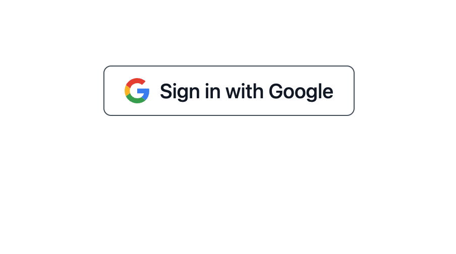

# Twitter-Clone

## tech
- Next.js
- NextAuth.js
- Firebase
- Heroicons
- Moment.js
- Tailwind CSS
- Autoprefixer

## Description

これは、学習目的で私が開発した twitter（現 X）の主要機能を実装したクローンです。以下の機能をサポートしています。

- Tweet (Post)
- Delete Tweet (Post)
- Comment & Like Tweet (Post)
- Signin & Signout using Google accounts

## App overview

### `/` Rootディレクトリー
　RootディレクトリーではTweet一覧、新規投稿フォーム、サイドバーのウィジェットが表示されます。

- `/` not Signed  
  未ログイン時はユーザーは新規投稿、Like、コメントを行うことができません。

<p align="center"> 
     
</p>

- `/` Signed  
 ログイン時はユーザーは新規投稿、Like、コメントをすることができ、自分の投稿は出現するゴミ箱アイコンで削除することが可能になります。サイドバーに各種アイテムとログインしている自分のアカウントが表示されます。サイドバーのアイコンをクリックするとサインアウトすることができます。
<p align="center"> 
     
</p>

### `/auth/signin` Auth ページ
NextAuthとFirebaseを使用してGoogleアカウントでSign inできるようになっています。
<p align="center"> 
     
</p>

### `/posts/[id]` posts ページ
投稿をクリックすると投稿の詳細画面にいきコメントも見ることができます。
<p align="center"> 
     
</p>


## Responsive Layout
このアプリはレスポンシブデザインになっており、Tailwind CSSを使用しています。
<p align="center"> 
     
</p>

## Getting Started

First, install modules and run the development server:

```bash
npm install --legacy-peer-deps

npm run dev
# or
yarn dev
```

Open [http://localhost:3000](http://localhost:3000) with your browser to see the result.

Check firestore Datebase and storage expiry dates in firebase and change the rules if necessary.