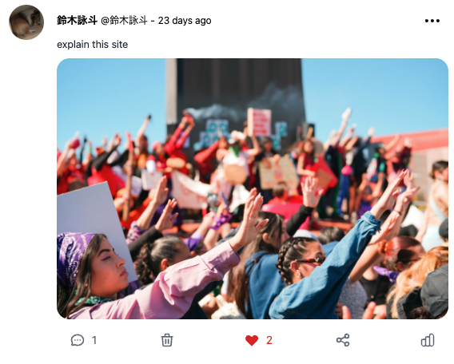
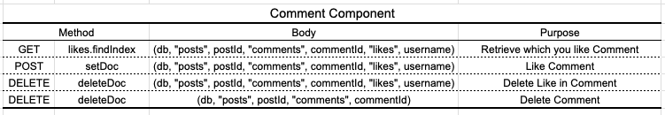

# Twitter-Clone

https://twitter-clone-next-ibfs7avi4-eightsuzukis-projects.vercel.app/
こちらのサイトからデプロイしたものが見れます。デプロイしたものにはログイン機能は対応させていません。

## Description


学習目的で twitter（現 X）の主要機能を実装したクローンアプリです。以下の機能をサポートしています。

- Tweet (Post)
- Delete Tweet (Post)
- Comment & Like Tweet (Post)
- Signin & Signout using Google accounts

## App overview

### `/` Rootディレクトリー
　RootディレクトリーではTweet一覧、新規投稿フォーム、サイドバーのウィジェットが表示されます。

- `/` not Signed  
  未ログイン時はユーザーは新規投稿、Like、コメントを行うことができません。

<p align="center"> 
     
</p>

- `/` Signed  
 ログイン時はユーザーは新規投稿、Like、コメントをすることができ、自分の投稿は出現するゴミ箱アイコンで削除することが可能になります。サイドバーに各種アイテムとログインしている自分のアカウントが表示されます。サイドバーのアイコンをクリックするとサインアウトすることができます。
<p align="center"> 
     
</p>

### `/auth/signin` Auth ページ
NextAuthとFirebaseを使用してGoogleアカウントでSign inできるようになっています。
<p align="center"> 
     
</p>

### `/posts/[id]` posts ページ
投稿をクリックすると投稿の詳細画面にいきコメントも見ることができます。
<p align="center"> 
     
</p>

## DataModel

<p align="center"> 
     
</p>
<p align="center"> 
     
</p>
<p align="center"> 
     
</p>

## Method
### Post　Component
1つのPostを表示するコンポーネントで、Postの情報を表示し、PostのLike、Commentの数を表示します。Deleteも可能です。
<p align="center"> 
     
</p>

<p align="center"> 
     
</p>


### Comment　Component
Postに対するCommentを表示するコンポーネントで、Commentの情報を表示します。Deleteも可能です。
<p align="center"> 
     
</p>

<p align="center"> 
     
</p>


### Comment Modal　Component
 Postに対するCommentを投稿するコンポーネントです。
<p align="center"> 
     
</p>

<p align="center"> 
     
</p>

### Feed　Component
最新の投稿順に並べてPostを表示します。
<p align="center"> 
     
</p>

<p align="center"> 
     
</p>

### Signin　Component
 NextAuth.JSとFirebaseを使用し認証します。getProviderで使用可能のproviderを取得します。今回のproviderはGoogleのみを指定しておりGoogle AccountでSign inできます。
<p align="center"> 
     
</p>

<p align="center"> 
     
</p>

### Sidebar　Component
 サイドバーには、randomuserapi.comから取得したユーザー情報、saurav.techのNewsAPIを表示しています。
<p align="center"> 
     
</p>

<p align="center"> 
     
</p>

## Responsive Layout
このアプリはレスポンシブデザインになっており、Tailwind CSSを使用しています。
<p align="center"> 
     
</p>

## tech
- Next.js
- NextAuth.js
- Firebase
- Heroicons
- Moment.js
- Tailwind CSS
- Autoprefixer

## Getting Started

First, install modules and run the development server:

```bash
npm install --legacy-peer-deps
```
```bash
npm run dev
# or
yarn dev
```

Open [http://localhost:3000](http://localhost:3000) with your browser to see the result.

Check firestore Datebase and storage expiry dates in firebase and change the rules if necessary.