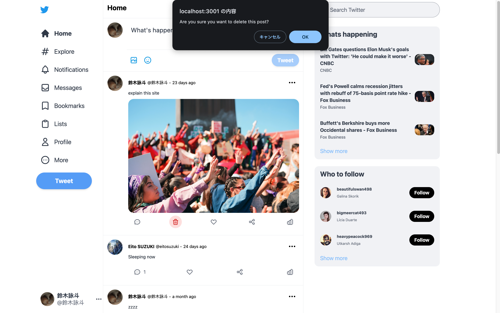

# Twitter-Clone-NextJS

This is a [Next.js](https://nextjs.org/) project bootstrapped with [`create-next-app`](https://github.com/vercel/next.js/tree/canary/packages/create-next-app).


# Overview

notSigin
/

Signin
/

/auth/signin

/posts/[id]

# tech

tailwind
heroicons
recoil
next auth
firebase

# Posts

posts/O2cDWAQJbuzjLgqhBUJT

# Auth

# Widget

# data

# Twitter Clone

## Description

これは、学習目的で私が開発した twitter（現 X）の主要機能を実装したクローンです。以下の機能をサポートしています。

- Tweet (Post)
- Delete Tweet (Post)
- Comment & Like Tweet (Post)
- Signin & Signout using Google accounts

## App overview

### `/`
　RootディレクトリーではTweet一覧、新規投稿フォーム、サイドバーのウィジェットが表示されます。

#### notSigned　`/`
 未ログイン時はユーザーは新規投稿、Like、コメントを行うことができません。

<p align="center"> 
     
</p>

#### Signed　`/`
 ログイン時はユーザーは新規投稿、Like、コメントをすることができ、自分の投稿は出現するゴミ箱アイコンで削除することが可能になります。サイドバーに各種アイテムとログインしている自分のアカウントが表示されます。サイドバーのアイコンをクリックするとサインアウトすることができます。
<p align="center"> 
     
</p>

### `/auth/signin`

/posts/[id]


<p align="center"> 
     
</p>

<p align="center"> 
     
</p>


<p align="center"> 
     
</p>


<p align="center"> 
     
</p>

### Responsive Layout
　The app uses Tailwind CSS for responsive design. It supports layout changes on different screen sizes.
<p align="center"> 
     
</p>

## Getting Started

First, install modules and run the development server:

```bash
npm install --legacy-peer-deps

npm run dev
# or
yarn dev
```

Open [http://localhost:3000](http://localhost:3000) with your browser to see the result.

Check firestore Datebase and storage expiry dates in firebase and change the rules if necessary.